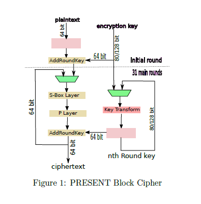

# Computer Architecture - Implementation of Cryptographic Ciphers

Cryptography is the science of secret writing. In cryptography, un-encrypted data (plain text) is encrypted into ciphertext using a secret key, which might subsequently (usually) be decrypted back into usable plain text. A cryptographic cipher is an algorithm used to perform this encryption and decryption. In this assignment, you will be working with data encryption only. 

## 1.1 PRESENT Cipher

The PRESENT cipher [1] is an ISO/IEC standardized lightweight block cipher. It accepts input plain text of 64 bits and supports keys that are either 80 bits or 128 bits wide. In this assignment, you will be working with a key size of 80-bits. PRESENT consists of three basic operations: AddRoundKey, Substitution, and Permutation. These operations are repeated 31 times to obtain the final encrypted output. Fig.1 shows the block diagram of the PRESENT cipher.

<p align="center"></p>

Substitution-Box: S-boxes are used to substitute bits with other patterns (known as confusion). PRESENT uses 4x4 S-boxes. The current state of
the S-box layer, b 63 ...........b 0 is considered as sixteen 4-bit words (nibble). w 15 .............w 0 where, 
wi = b 4i+3||b 4i+2||b 4i+1||b 4i for 0 <= i <= 15. Here || is the concatenation operation. The output nibbles [wi] provides the updated state values. There are many design techniques available in the literature for designing of the S-box layer.


<p align="center"></p>

Permutation-Box :The permutation-box permutates(diffuses) the bits. The
operation of the P-Box is explained as follows:

P: (0,1)^64 →(0,1)^64
Here, the 64 input bits to the P-box (c) are mapped to a permutated set of 64 output bits (d).
For 0 6 i 6 15, do :
c 4i||c 4i+1||c 4i+2||c 4i+3 → di||di+16||di+32||di+48

Key Schedule: PRESENT uses different keys for each round of encryption.
These keys are known as ‘round keys’. These 64-bit round keys are generated
according to a key schedule mechanism. The user-supplied key is stored in a 80
bit key register K. For any round, the round key consists of the leftmost 64 bits of
current content of the key register. Thereafter, key register K=k 79 k 78 .......k 1 k 0
is updated according to the following equations:


1. [k 79 k 78 ...........k 1 k 0 ] = [k 18 k 17 .....k 0 k 63 .......k 20 k 19 ]
2. [k 79 k 78 k 77 k 76 ] = S [k 79 k 78 k 77 k 76 ]
3. [k 19 k 18 k 17 k 16 k 15 ] = [k 19 k 18 k 17 k 16 k 15 ]  ⊕ RoundCounter
Here, ‘S’ represents S-box and RoundCounter is the output value of the counter
which is used to count the number of rounds of encryption.

### 1.2 Eight-Sided Fortress (ESF) Cipher

A feistel network first divides a data block into two equal subblocks and then
encryption process is performed in multiple rounds. ESF [3] is a lightweight
feistel cipher. It accepts input plaintext of 64 bits. It uses a 80-bit key.

<p align="center"></p>

Encryption Process : The basic operation of the ESF cipher is shown in Fig.2(a). The encryption process is explained in the following steps:

1. The 64-bit input plaintext is divided into two 32-bit data block :R0 and L0.
2. The leftmost 32-bit feildL 0 is left sifted by 7 bits while the rightmost 32-bitR 0 enters the round function ‘F’. The details of the round function are explained next.
3. The XOR operation is performed betweenL 0 <<7 and the output of F.
4. In the end, we swap the leftmost and rightmost chunks of 32 bits.
These steps are repeated for all the rounds of encryption. It should be noted that in the last round no swapping of the data is done. Finally the 64-bit ciphertext is obtained.

```
x 0 1 2 3 4 5 6 7 8 9 10 11 12 13 14 15
S0[x] 3 8 15 1 10 6 5 11 14 13 4 2 7 0 9 12
S1[x] 15 12 2 7 9 0 5 10 1 11 14 8 6 13 3 4
S2[x] 8 6 7 9 3 12 10 15 13 1 14 4 0 11 5 2
S3[x] 0 15 11 8 12 9 6 3 13 1 2 4 10 7 5 14
S4[x] 1 15 8 3 12 0 11 6 2 5 4 10 9 14 7 13
S5[x] 15 5 2 11 4 10 9 12 0 3 14 8 13 6 7 1
S6[x] 7 2 12 5 8 4 6 11 14 9 1 15 13 3 10 0
S7[x] 1 13 15 0 14 8 2 11 7 4 12 10 9 3 5 6
```
Round Function : ESF uses a substitution-permutation network for computing the round function ‘F’. The rightmost 32 bits of the intermediate data are XORed with the round key. This is followed by the substitution and permutation operations respectively. This is shown in Fig.2(b).

Substitution-Box : ESF uses eight different 4X4 SERPENT S-boxes to perform substitution operations. You can explore about them from the references.

Permutation-Box :A P-box performs bit-wise permutation. The input and output are of 32 bits each. The design principle of the P-Box is the same as that of the PRESENT cipher. However, it should be noted that PRESENT uses a 64-bit P-Box while ESF uses a 32-bit P-box.

Key Schedule of ESF Cipher: The user-supplied key is stored in the 80-bit key register K. The 32-bit round key is extracted as the leftmost 32 bits of the current content of the key register. Thereafter, the key register
K=[k 79 k 78 ..........k 1 k 0 ] is updated according to the following steps:

1. K << 13
2. [k 79 k 78 k 77 k 76 ]=S 0 [k 79 k 78 k 77 k 76 ]
3. [k 75 k 74 k 73 k 72 ] =S 0 [k 75 k 74 k 73 k 72 ] ; [k 47 k 46 k 45 k 44 k 43 ] = [k 47 k 46 k 45 k 44 k 43 ] ⊕ 
RoundCounter;
Here,S 0 represents S-box and RoundCounter is the output value of the counter which is used to count the number of rounds of encryption.

### Implementation
- Logisim can be run from the command line using: java -jar logisim-XX<pathtocircuit>.cir
    Logisim also provides a RAM module that can be used to load data from the command line. The syntax for this is as follows:
    java -jar logisim-XX <pathtocircuit>.circ -tty table -load memimg.txt
- You can download and install LogiSim version 2.7.
- Your circuits should work for 64-bit plaintext inputs and, 80-bit key.
- The design should be iterative. The same hardware circuit should work for multiple clock cycles to complete all the rounds of encryption.
- Your design should include 18 S-boxes for PRESENT and 10 S-boxes for the ESF cipher.
- The data path of the architecture can be divided into multiple processing lines of 32-bits (or less). Make sure to synchronize your design well.
- You can check the correctness of your implementation with the set of test vectors provided in the files:PRESENTtest.txtandESFtest.txt.

### Input and Output File Format

- We will follow the description below to provide inputs to our circuit: The memimg.txtwill be used to load data into a RAM with a 32-bit data line and a 3-bit address line. 
- In the memimg.txt file, the first address will be used to store the lowest 32 bits of the plaintext. Address 1 will contain the MSB bits (32:63) of the plaintext. Address 2 will contain the lowest 32 bits (0:31) of the key. Address 3 will contain the next 32 bits of the key. The lowest 16 bits of address 4 will contain the most significant 16 bits of the key. Fig.3 shows the contents of the RAM.
- The output pins should be ordered such that the 32 LSB bits are printed first, and the 32 MSB bits are printed next when using the command line. You also have to ensure that only the final output is printed and not the intermediate results.


